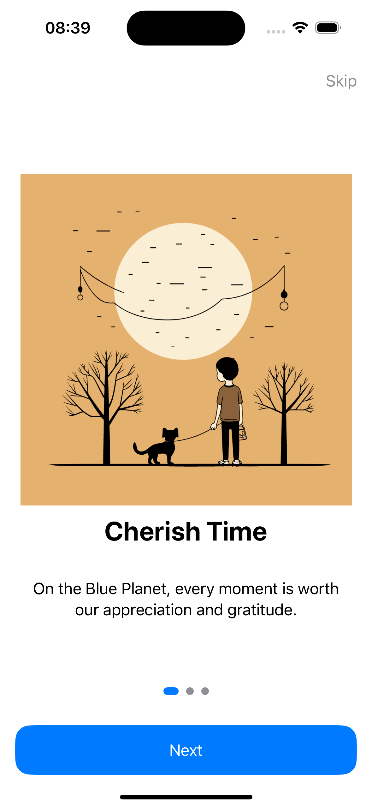
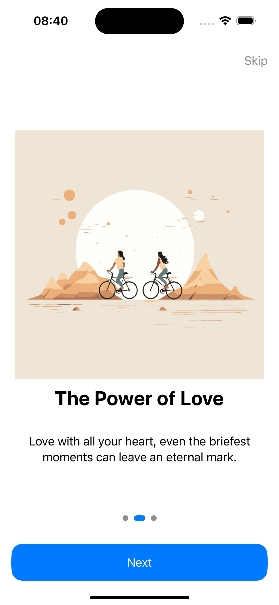
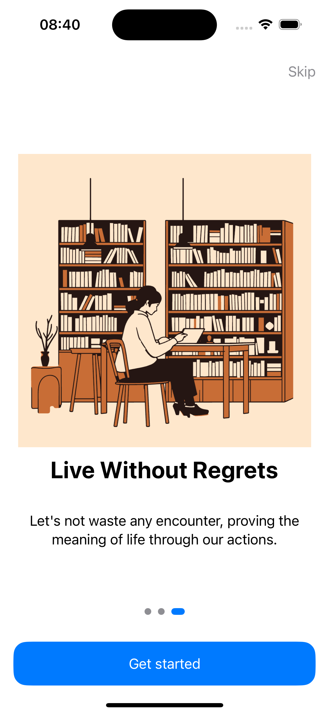

## OnBoarding

Welcome to our SwiftUI Bootcamp example! This project is designed to showcase a simple yet effective onboarding experience using SwiftUI. The core of this example lies within the `ContentView.swift` file, where we have meticulously crafted a user interface that guides users through a series of onboarding steps.

### Features

- **Custom Data Model**: We utilize a custom `OnBoardingStep` struct that holds information for each step of the onboarding process, including an id, image, title, and description.
- **Dynamic Content**: The onboarding steps are dynamically generated using a `ForEach` loop, allowing for easy customization and scalability.
- **User Interaction**: Users can navigate through the onboarding steps using a combination of swipe gestures and buttons. A "Skip" button allows users to quickly move to the last step, while a "Next" button progresses them through the steps. The final button changes to "Get started" upon reaching the last step.
- **Visual Indicators**: A series of circles at the bottom of the screen serve as visual indicators of the current step, enhancing the user experience.

### Implementation Highlights

- **SwiftUI Views**: The entire UI is built using SwiftUI, showcasing the power and simplicity of declarative UI programming.
- **State Management**: We use `@State` to manage the current step the user is on, demonstrating state management within SwiftUI.
- **Custom Styling**: The UI elements are styled to provide a visually appealing experience, including custom fonts, colors, and shapes.

### Screenshots

Here are some screenshots showcasing the final implementation of the onboarding experience:

  
  
  

### Getting Started

To explore this example, simply clone the repository and open the project in Xcode. Navigate to the `ContentView.swift` file to see the implementation details. You can run the project in the Xcode simulator to experience the onboarding process firsthand.

### Conclusion

This SwiftUI Bootcamp example serves as a practical introduction to creating engaging user interfaces with SwiftUI. Whether you're new to SwiftUI or looking to enhance your skills, this project provides valuable insights into building dynamic and interactive UIs.

We hope you find this example both informative and inspiring as you embark on your SwiftUI journey!
